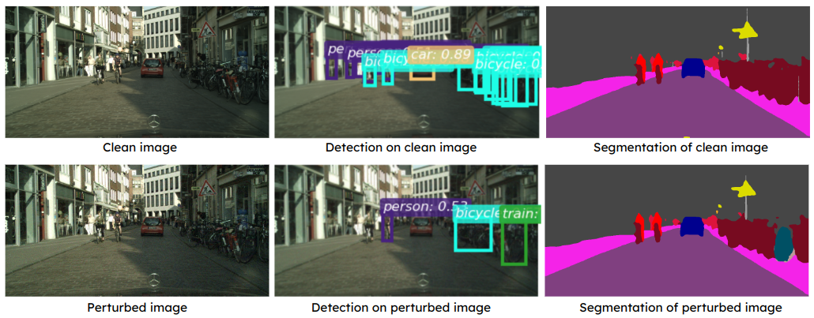
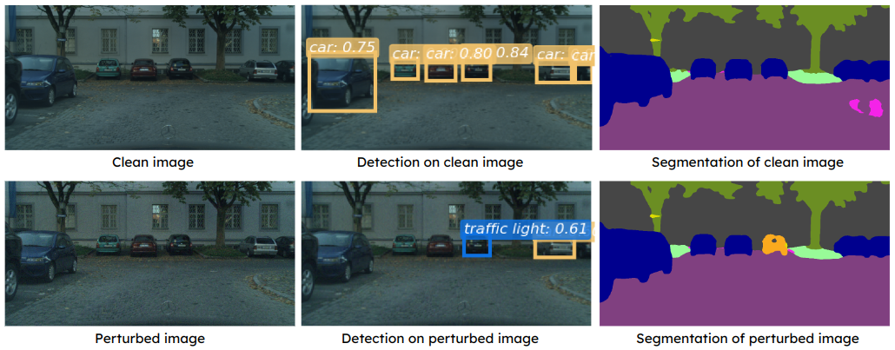
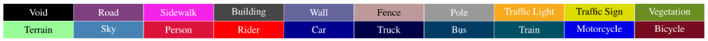

# Ensemble-based Blackbox Attacks on Dense Prediction
### [Paper](TBD) | [Code](https://github.com/CSIPlab/EBAD)


Pytorch implementation of *Ensemble-based Blackbox Attacks on Dense Prediction* in CVPR 2023.

[Ensemble-based Blackbox Attacks on Dense Prediction](https://arxiv.org/abs/2208.03610)  
 [Zikui Cai](https://zikuicai.github.io/), [Yaoteng Tan](https://ytengtan.github.io/), [M. Salman Asif](https://intra.ece.ucr.edu/~sasif/)<br>
 UC Riverside 

We propose an approach for adversarial attacks on dense prediction models (such as object detectors and segmentation). In this paper, we show that a carefully designed ensemble can create effective attacks for a number of victim models. In particular, we show that normalization of the weights for individual models plays a critical role in the success of the attacks. We then demonstrate that by adjusting the weights of the ensemble according to the victim model can further improve the performance of the attacks. Finally, we show that our proposed method can also generate a single perturbation that can fool multiple blackbox detection and segmentation models simultaneously.


Attack multiple blackbox models of different tasks simultaneously using a single perturbation.
<center>





</center>

Attack video object detection.
<center>
<a href="https://player.vimeo.com/video/811461221?h=3e0765a066&amp;badge=0&amp;autopause=0&amp;player_id=0&amp;app_id=58479"> </a>

<a href="https://player.vimeo.com/video/811461200?h=b2a3a41f62&amp;badge=0&amp;autopause=0&amp;player_id=0&amp;app_id=58479"> </a>
</center>


## Environment

* python==3.8
* torch==1.11.0
* torchvision==0.12.0
* mmcv-full==1.5.1
* [mmdetection v2.24.1](https://github.com/open-mmlab/mmdetection/tree/v2.24.1)
* [mmsegmentation v0.27.0](https://github.com/open-mmlab/mmsegmentation/tree/v0.27.0)


## Datasets

Object detection: get VOC and COCO datasets under `/data` folder.
```
cd data
bash get_voc.sh
bash get_coco.sh
```


Semantic segmentation:
Download and prepare Cityscapes and VOC datasets by the [instructions](https://mmsegmentation.readthedocs.io/en/latest/dataset_prepare.html). Place dataset folders under `mmsegmentation/data` folder.


## Perform attacks

### Object detection

1. Download and place `mmdetection` folder under EBAD directory.

2. run ```python mmdet_model_info.py``` to download pre-trained models from MMCV.

3. run ```python attack_bb_det.py``` to perform attacks on object detection.

### Semantic segmentation

1. Download and place `mmsegmentation` folder under EBAD directory.

2. Download and proccess datasets. Place dataset folders under `mmsegmentation/data/`.

3. Replace definition of ```simple_test``` in `mmsegmentation/mmseg/models/segmentors/encoder_decoder.py` with following code block in order to support our attack algorithm.
```
def simple_test(self, img, img_meta, rescale=True):
    """Simple test with single image."""
    seg_logit = self.inference(img, img_meta, rescale)
    seg_pred = seg_logit.argmax(dim=1) # clean prediction
    seg_pred_ll = seg_logit.argmin(dim=1)  # least likely
    seg_pred_ml = seg_logit.topk(2, dim=1).indices[:, 1, :] # 2nd-most likely
    if torch.onnx.is_in_onnx_export():
        # our inference backend only support 4D output
        seg_pred = seg_pred.unsqueeze(0)
        return seg_pred
    seg_pred = seg_pred.cpu().numpy()
    seg_pred_ll = seg_pred_ll.cpu().numpy()
    seg_pred_ml = seg_pred_ml.cpu().numpy()
    # unravel batch dim
    seg_pred = list(seg_pred)
    seg_pred_ll = list(seg_pred_ll)
    seg_pred_ml = list(seg_pred_ml)
    return seg_pred + seg_pred_ml + seg_pred_ll
```
4. run ```python mmseg_model_info_cityscapes.py``` and```python mmseg_model_info_voc.py``` to download pre-trained models from MMCV.

5. run ```python attack_bb_seg.py --target ll --n_wb 2 --iterw 20 --n_imgs 10 --victim PSPNet --data cityscapes```
    to perform a N=2, Q=20 targeted ensemble attack using least-likely label against PSPNet on 20 Cityscapes images
    
    Use ```-untarget``` option to perform untargeted attack.
    Use ```-save_queries``` to save visualization of each attack query result, and use ```-visualize``` to save visualization of our attack.

### Joint attack
To perform attacks on object detection and segmentation jointly, run ```python attack_bb_det_seg.py```.
